 

  
  
  
  

  
  
  
  

## ⚡ Snapshot

<table>
  <tr>
    <td align="center" width="25%"><b>🧠 Domains</b> Healthcare • Finance • Telecommunications</td>
    <td align="center" width="25%"><b>🧱 I Build</b> ETL • Analytics • ML/NLP Systems</td>
    <td align="center" width="25%"><b>🎯 Current Focus</b> Production-Grade Agents • MLOps • RWE Generation</td>
    <td align="center" width="25%"><b>🔎 Default Mode</b> Metrics • Reproducibility • Explainability</td>
  </tr>
</table>

---

## 🧰 Tech Stack (Icon-First)

**LangGraph • MCP • NVIDIA Triton • Snowflake**

---

## 📈 GitHub Stats

 

---

## 🧠 About Me (Fast, Specific, Credible)

- 🧱 I build **Agentic AI systems** using **LangGraph** and **MCP** to automate complex research workflows.
- 🧪 I ship **ML/NLP** with reproducible experiments and evaluation you can trust.
- 🧰 I design **ETL pipelines** that stay stable under schema drift and unstructured inputs.
- 🔍 I use **explainability** (e.g., Grad-CAM) when the model must earn confidence.
- 🎮 Off-hours: **gaming + movies**.

### 🧨 Costly Signaling (Hard Problems I Like)
- 📊 **Data quality**: validation rules, anomaly checks, dataset contracts  
- 🧵 **MLOps**: Optimized model memory by 69% via INT8 quantization using **NVIDIA Triton**
- ⚖️ **Compliance**: Designing systems for **HIPAA, GDPR, and FHIR** standards in healthcare
- 🧠 **Agents**: measurable workflows (tools + eval), not “demo-only” bots  

  
<b>📌 What I value in projects</b>

- Clear success metrics (baseline → improvement)
- Reproducible runs (env, seeds, configs)
- Fail-safe data pipelines (tests + schema contracts)
- Model behavior you can explain to non-ML stakeholders

---

## 🏗️ Featured Projects

<a href="https://github.com/suryayalavarthi/Agentic-AI-Workflow-Orchestrator">
  <picture>
    <source srcset="https://github-readme-stats.vercel.app/api/pin/?username=suryayalavarthi&repo=Agentic-AI-Workflow-Orchestrator&hide_border=true&theme=tokyonight&cache_seconds=86400" />
    
  </picture>
</a>

<a href="https://github.com/suryayalavarthi/Sentinel">
  <picture>
    <source srcset="https://github-readme-stats.vercel.app/api/pin/?username=suryayalavarthi&repo=Sentinel&hide_border=true&theme=tokyonight&cache_seconds=86400" />
    
  </picture>
</a>

<a href="https://github.com/suryayalavarthi/brain-tumor-detection-cnn">
  <picture>
    <source srcset="https://github-readme-stats.vercel.app/api/pin/?username=suryayalavarthi&repo=brain-tumor-detection-cnn&hide_border=true&theme=tokyonight&cache_seconds=86400" />
    
  </picture>
</a>

---

## 🤝 Collaborate / Hire Me

<b>Best fits:</b> Agentic AI • MLOps • Data Science • RWE Generation 
<b>I bring:</b> clean APIs • reproducible experiments • production mindset 
<b>Reach me:</b> <a href="mailto:suryavardhan15@gmail.com">suryavardhan15@gmail.com</a> • <a href="https://www.linkedin.com/in/surya-vardhan-yalavarthi/">LinkedIn</a> • <a href="https://suryayalavarthi.github.io">Portfolio</a>

---

 

 
<i>Built on signals: data quality, pipeline design, and measurable impact.</i>

